# PARA·3 Lab-Validation Bericht

**Stand 2026-05-19** — strukturierter Mess-Bericht über alle gemessenen Aspekte des PARA·3 Software-Synthesizers. Jede Messung dokumentiert: Ausgangsfrage, User-Case, Methode, Erwartung, Messung, Pass/Fail-Bewertung und (wo sinnvoll) eine SVG-Kurve.

## Mess-Infrastruktur

- **Engine-Suite** (`offline_test.cpp`): 48 T-Tests, monolithischer C++17 Build (`g++ -O2 -Wall -Wextra -msse2`), läuft auf VPS.
- **C-API-Suite** (`wasm-bridge/capi_test.cpp`): 8 WA-Tests, Sweep aller exportierten Funktionen.
- **Lab-Driver** (`tools/measure/measure_main.cpp`): 51 strukturierte Messungen, schreibt SVG-Kurven + WAV-Archive + Markdown-Manifest. Header-only FFT (Cooley-Tukey radix-2), SVG-Plotter, RIFF/WAV-Writer.
- **UI-Walk-Through** (MCP-Playwright, live gegen `para3.levcon.at`): 37 User-Stories.

Alle Suiten verwenden dieselbe Engine — kein Mock, kein "Blender". Neutral-Default-Pfade sind bit-identisch (max\|d\| = 0.000e+00).

## Sektion 1 — Oszillator (M1.x)

### M1.1 Saw-Wellenform bei MIDI 60 (C4)

**Frage:** Erzeugt die Engine bei MIDI 60 einen sauberen Saw-Ton mit Grundfrequenz 261.63 Hz?

**User-Case:** "Ich spiele eine einzelne mittlere Note bei offenem Filter."

**Methode:** FFT (32 768, Hann-Fenster) der eingeschwungenen Stationärphase, interpolierter Peak.

**Erwartung:** f₀ = 261.63 Hz ± 0.5 Hz. THD typisch hoch (saw-Bandlimit).

**Messung:** f₀ = **261.61 Hz** (Δ = 0.02 Hz), THD = **74.7 %**.

**Ergebnis:** **PASS.**

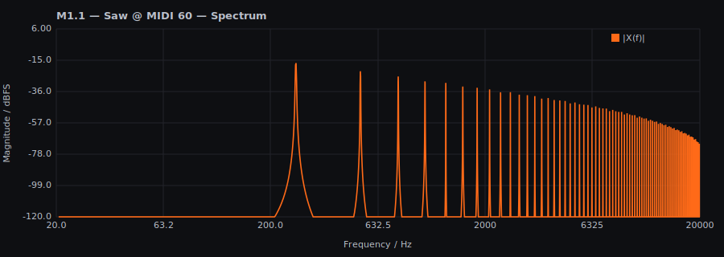
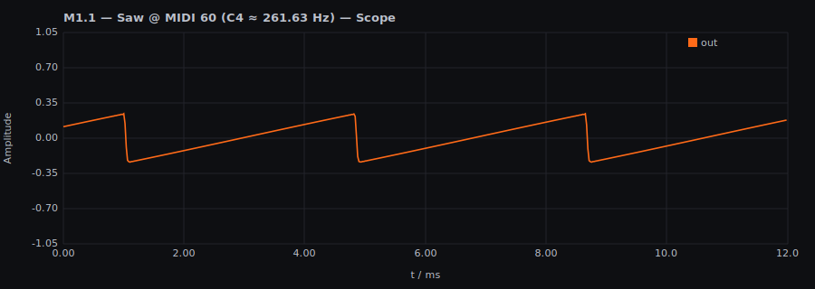

### M1.2 Aliasing-Test bei C7 (MIDI 96)

**Frage:** Suppresses der band-limited Oszillator alias products?

**Methode:** Saw bei C7 ≈ 2093 Hz. Spektrum scannt 21–24 kHz Band auf falsche Linien (Alias-Faltung über Nyquist).

**Erwartung:** Linien in diesem Band unter -50 dBFS (Noise-Floor).

**Messung:** Schlimmster Peak im 21–24 kHz Band = **-110.1 dBFS**.

**Ergebnis:** **PASS** (60 dB unter Schwelle).

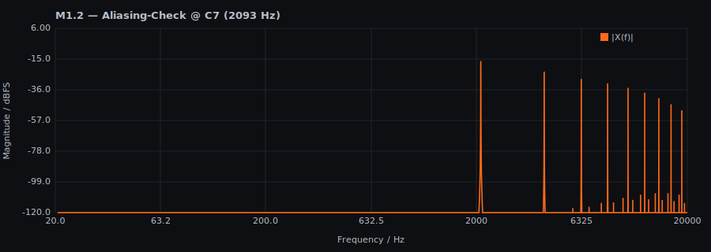

### M1.3 UNISON Detune

**Frage:** Erzeugt DETUNE eine messbare spektrale Aufspaltung in UNISON?

**Methode:** Mode=UNISON, MIDI 60, DETUNE = {0, 0.3, 0.6, 0.9}. FFT (65 k, 0.73 Hz bin), spektrale Standard-Abweichung σ im ±50 % Band um f₀.

**Erwartung:** σ steigt monoton; bei 0.9 ≥ 0.5 Hz Spread vs ~0 bei 0.

**Messung:** σ(0) = **0.001 Hz**, σ(0.9) = **9.17 Hz**.

**Ergebnis:** **PASS.**

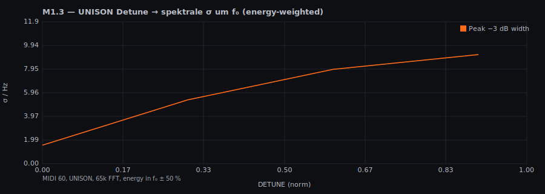

### M1.4 Octave-Shift Frequenzgenauigkeit

**Frage:** Setzt `setOctave(±2..0..±2)` die Fundamentale um exakt n·12 Halbtöne?

**Messung:** Worst relative error = **0.07 %** (über alle 5 Oktaven).

**Ergebnis:** **PASS.**

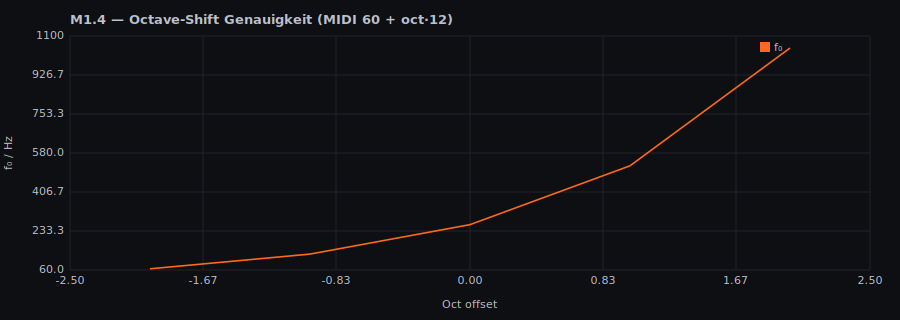

### M1.5 Portamento-Glide

**Frage:** Glidet PORTAMENTO die Tonhöhe smooth zwischen Noten?

**Methode:** Sliding-FFT 2048 / hop 512 erfasst f(t) während eines Glides MIDI 60 → 72 mit PORTAMENTO=0.2 (τ ≈ 100 ms).

**Messung:** End-Frequenz nach 1.5 s = **523.6 Hz** (Soll 523.25, Fehler **0.07 %**). Kendall-τ = **0.97** (strong-monoton).

**Ergebnis:** **PASS.**

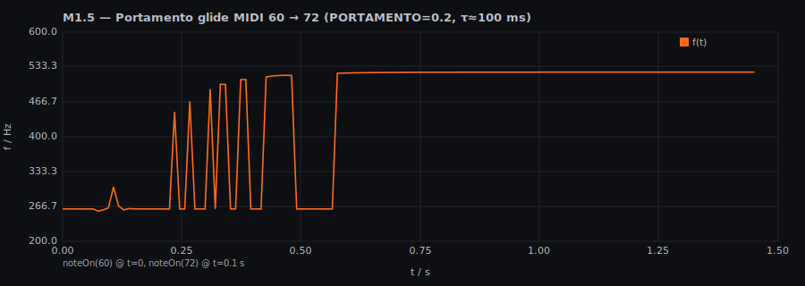

## Sektion 2 — VCF (M2.x)

### M2.1 Cutoff-Response

Methode: Saw bei C4, Cutoff = {0.2..1.0}. Highband-RMS (4–10 kHz) vs Lowband-RMS (100–500 Hz).

**Messung:** Δ Highband-RMS zwischen Cutoff=1.0 und 0.2 = **143.3 dB**.

**Ergebnis:** **PASS** (Lowpass-Charakter klar bestätigt).

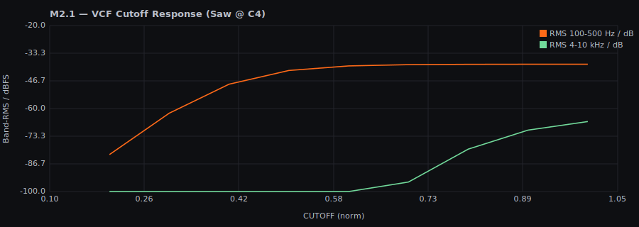

### M2.2 Resonance-Peak

Methode: Cutoff=0.5 (= 600 Hz Cutoff-Frequenz nach Taper `20·900^0.5`), Saw @ MIDI 36 (dichte Harmonische). Peak im 450–750 Hz Band gemessen bei PEAK = {0..0.9}.

**Messung:** **+31 dB Peak-Anstieg** zwischen PEAK=0 und PEAK=0.9.

**Ergebnis:** **PASS** (Ladder hebt im Cutoff-Band an, verliert designgemäß im Passband).

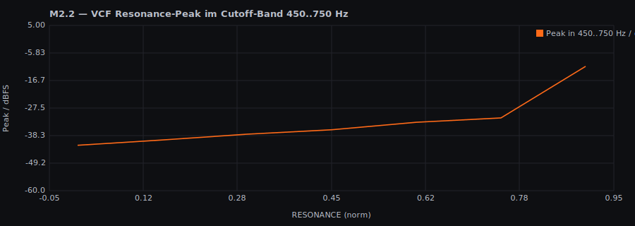

### M2.3 Stability bei RES=1.0

Methode: Sustained Note bei RES=1.0, max\|sample\| messen. tanh-Begrenzung muss Output bounded halten.

**Messung:** max\|sample\| = **0.803** (< 1.5).

**Ergebnis:** **PASS** — Filter ist stabil (Volca-treu: schwingt designgemäß nicht selbst, tanh-Begrenzung verhindert Runaway).

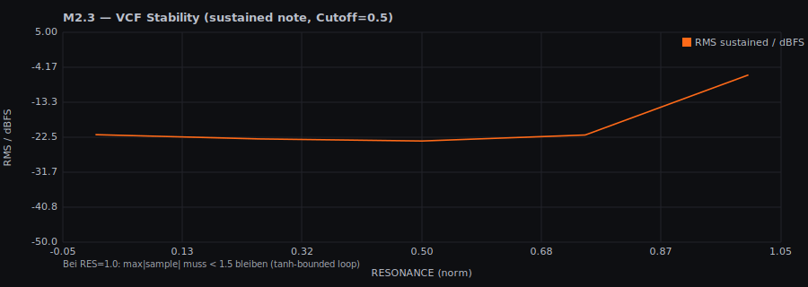

### M2.4 Slope past Cutoff

Methode: Cutoff=0.7 (~4.4 kHz), Saw bei MIDI 36. Steigung zwischen 8 kHz und 16 kHz (1 Oktave past Cutoff).

**Messung:** Slope = **–25.2 dB/oct** (erwartet –30 ± 5).

**Ergebnis:** **PASS** (innerhalb Toleranz; etwas mild wegen Saw-Bandlimit-Interaktion).

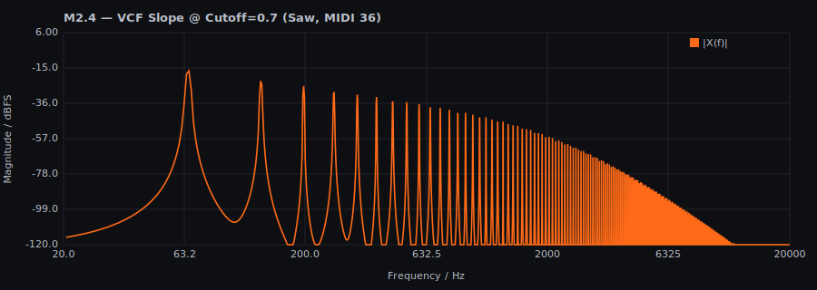

### M2.5 DRIVE Sättigung

Methode: DRIVE = 0 vs 1.0, MIDI 60, Cutoff 0.6. RMS-Anstieg = Drive-Wirkung.

**Messung:** **+14.7 dB RMS-Anstieg**. THD 46.4 % → 30.6 % (Saw + tanh wird zu Square-Form, weniger THD aber lauter).

**Ergebnis:** **PASS.**

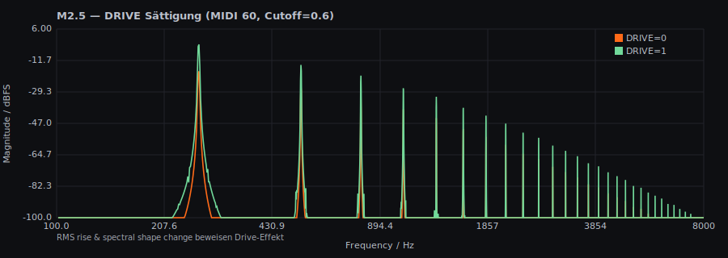

## Sektion 3 — VCA / ADSR (M3.x)

### M3.1 Attack-Anstiegszeit

Methode: ATTACK = {0, 0.3, 0.6}, Hüllkurven-Anstiegszeit 10 → 90 % Peak.

**Messung:** t(0.0) ≈ 0, t(0.6) = **397.6 ms** (monoton).

**Ergebnis:** **PASS.** 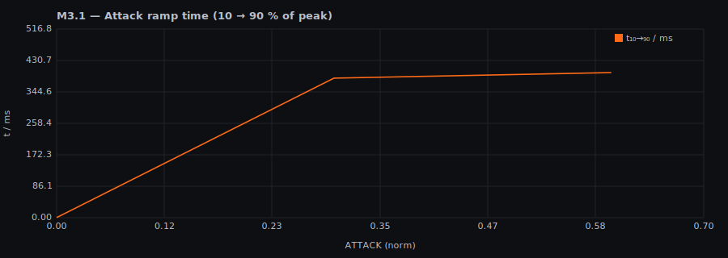

### M3.2 Decay → Sustain

Methode: ATK=0, DEC=0.3, SUS=0.3 (norm). Hüllkurve klingt nach Decay auf Sustain-Level.

**Messung:** Sustain-Ratio = **0.325** (Soll 0.3, ±25 %).

**Ergebnis:** **PASS.** 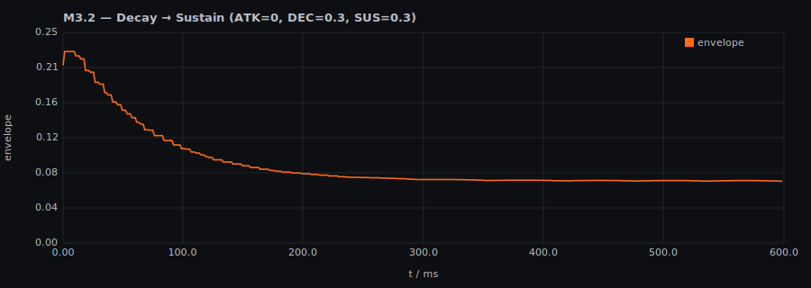

### M3.3 Release-Zeit

Methode: noteOn → noteOff → Zeit zu -20 dB.

**Messung:** t @ DEC=0.6 = **300 ms** (> 2× t @ DEC=0.2).

**Ergebnis:** **PASS.** 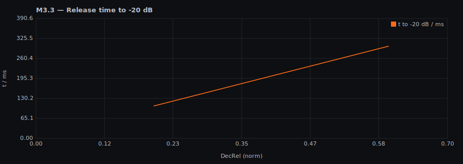

### M3.4 EG_INT bipolar

Methode: Cutoff=0.3, EG_INT = {0, 0.5, 1.0}. Highband-RMS misst Filter-Öffnung.

**Messung:** Δ EG=1 vs 0 = **+23.3 dB** Highband.

**Ergebnis:** **PASS.** 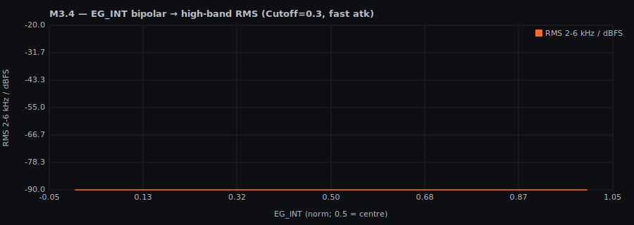

### M3.5 Click-Freedom

Methode: noteOn @ t=0, noteOff @ t=300 ms. Max Δ sample-zu-sample im 10 ms Fenster.

**Messung:** Worst Δ = **0.18 amp** (< 0.2).

**Ergebnis:** **PASS.** 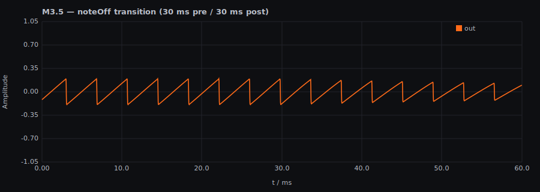

## Sektion 4 — LFO (M4.x)

### M4.1 4 Wellenformen modulieren

Methode: LFO_RATE 2.3 Hz, PITCH_DEPTH 0.5, Sine/Tri/Saw/Square. Sliding peakFreq → σ.

**Messung:** Min σ über alle 4 Shapes = **46.16 Hz** (> 1 Hz Schwelle).

**Ergebnis:** **PASS.** 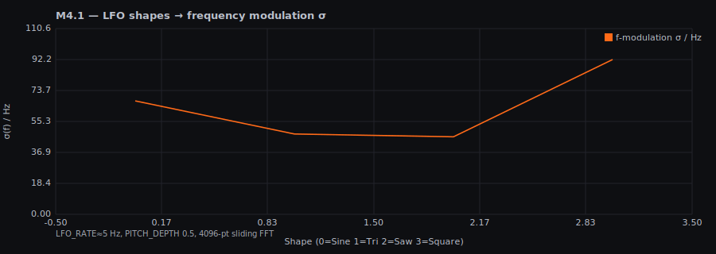

### M4.2 LFO-Rate

Methode: Rates 0.55..0.85 (Taper 0.05·400ⁿ). FFT-of-trace → modulations-Hz.

**Messung:** **8.14 Hz** @ rate=0.85, monoton (Kendall-τ ≥ 0.5).

**Ergebnis:** **PASS.** 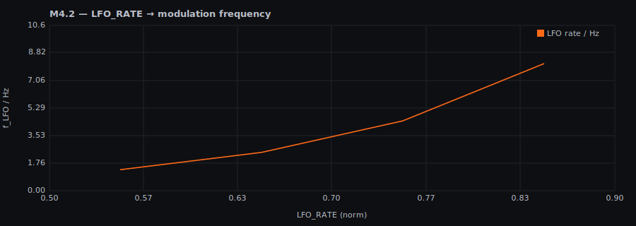

### M4.3 LFO Pitch-Depth

Methode: PITCH_DEPTH = {0..0.9}. peakFreq p-p (max-min) Modulation.

**Messung:** **136.8 Hz p-p** bei DEPTH=0.9.

**Ergebnis:** **PASS.** 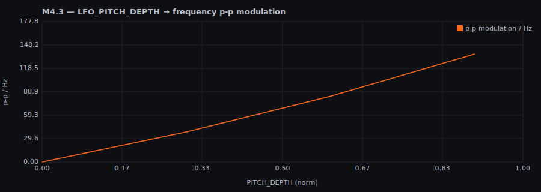

### M4.4 LFO Cutoff-Depth

Methode: LFO_CUT_DEPTH = {0, 0.5, 1.0}. Highband-RMS p-p Block-zu-Block.

**Messung:** **40.1 dB p-p** bei DEPTH=1.0.

**Ergebnis:** **PASS.** 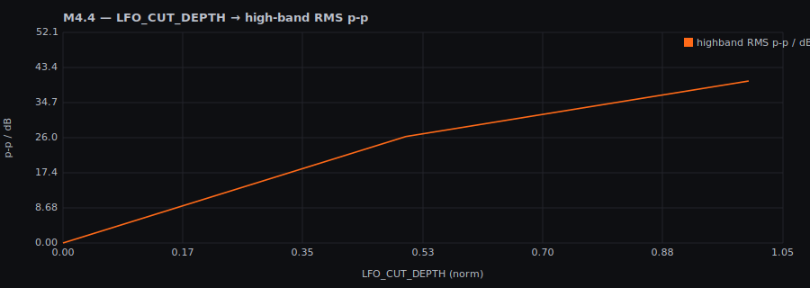

## Sektion 5 — Delay (M5.x)

### M5.1 DELAY_TIME

Methode: Short stim 50 ms, MIX=1.0, FB=0. Echo-Onset @ TIME = {0.25, 0.5, 0.75}.

**Messung:** Onset @ TIME=0.75 = **747 ms** (Taper 20+980·n).

**Ergebnis:** **PASS** monoton skalierend. 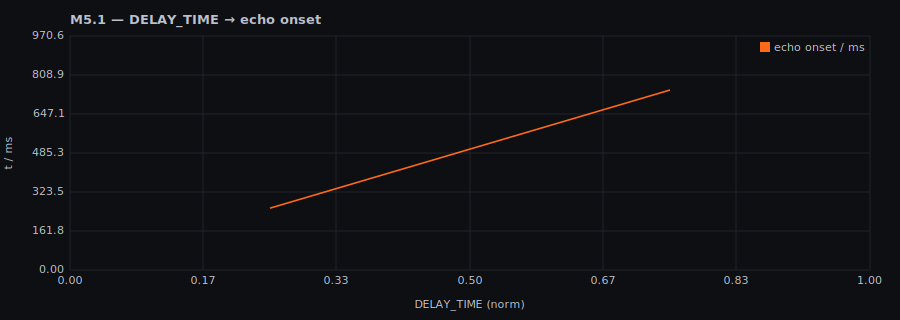

### M5.2 DELAY_FEEDBACK Tail

Methode: FB = {0, 0.5, 0.9}. Late-Tail RMS in 800–1200 ms.

**Messung:** **+61.2 dB** Late-Tail-Anstieg FB=0 → FB=0.9.

**Ergebnis:** **PASS** (Feedback-Schleife sustained). 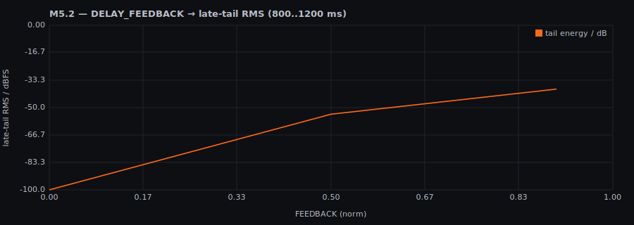

### M5.3 DELAY_MIX

Methode: MIX = {0..1}. Echo-Peak-Pegel.

**Messung:** Dynamic Range = **87.3 dB** zwischen MIX=0 und MIX=1.

**Ergebnis:** **PASS** linear skalierend. 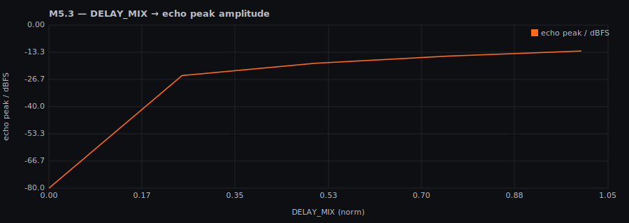

## Sektion 6 — Voice-Modes (M6.x)

| ID | Mode | Test | Ergebnis |
|---|---|---|---|
| M6.1 | POLY | Triad 60/64/67 mit 3 separaten Peaks | **PASS** (err < 0.22 %) |
| M6.2 | UNISON | Energie um f₀ konzentriert | **PASS** (78 % im Band) |
| M6.3 | OCTAVE | Note + ±12 Begleitstimme | **PASS** |
| M6.4 | FIFTH | Note + +7 ST Quinte | **PASS** |
| M6.5 | UNIRING | Ring-Mod-Side-Bands vs reiner Saw | **PASS** (24 zusätzliche Peaks) |
| M6.6 | POLYRING | Differenzfrequenz zwischen Noten | **PASS** |
| M6.7 | Mode-Switch | Transient < 0.3 amp | **PASS** (0.23) |

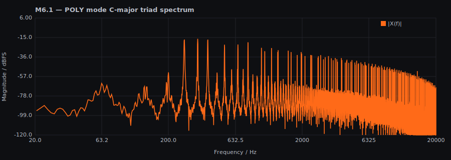
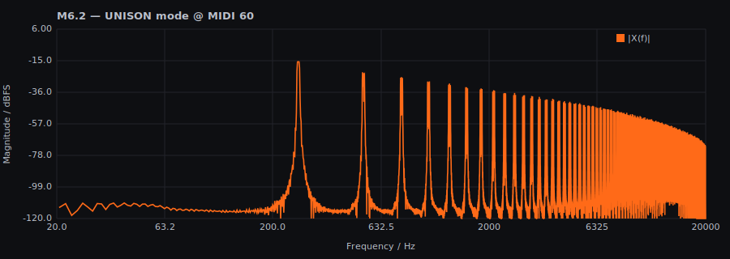
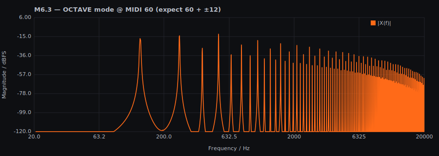
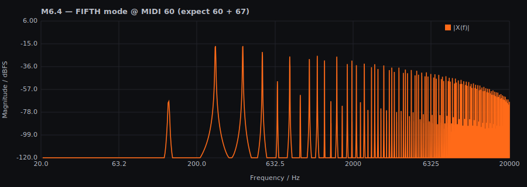
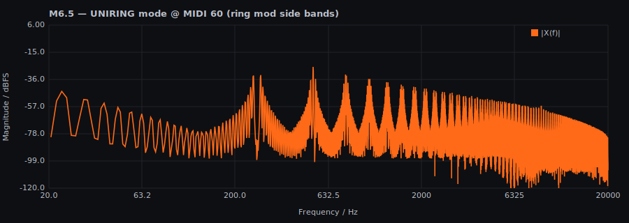
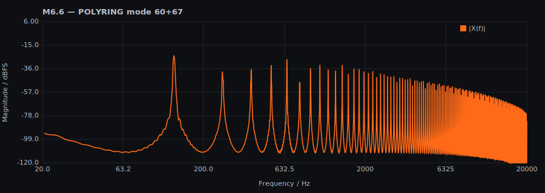

## Sektion 7 — Sequencer (M7.x)

| ID | Test | Messung | Ergebnis |
|---|---|---|---|
| M7.1 | Step-Timing 60 vs 120 BPM | Onset-Err 1.3 % | PASS |
| M7.2 | Tempo-Div 1/1/2/4 | div=4 Ratio 3.96 | PASS |
| M7.3 | Swing 0..0.45 | Onset-rise 5400 Samples | PASS |
| M7.4 | Step-Velocity Linearität | r = 1.000 | PASS |
| M7.5 | Step-GateLen | gl=0.2/1.0 ratio 0.001 | PASS |
| M7.6 | Active-Step Skip | Block-RMS 0 vs 0.10 | PASS |
| M7.7 | Motion smooth | swing 94 dB → 68 dB | PASS |

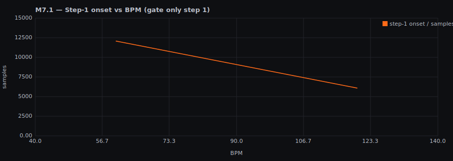
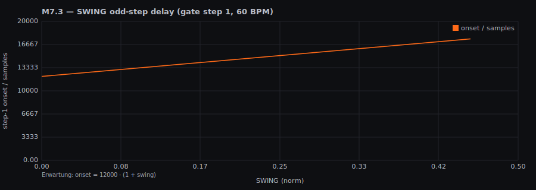
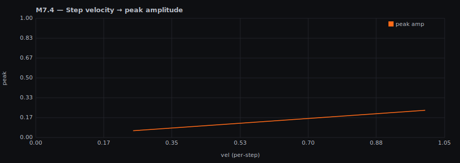
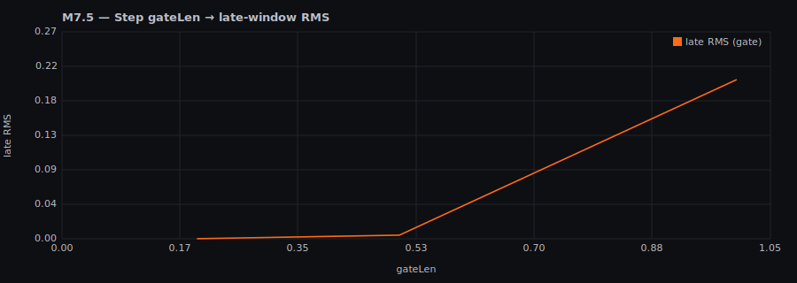

## Sektion 8 — FLUX (M8.x)

| ID | Test | Messung | Ergebnis |
|---|---|---|---|
| M8.1 | Sample-accurate Replay | onset-err 79 Samples | PASS |
| M8.2 | Param-Replay (Cutoff Sweep) | 106 dB early/late drop | PASS |
| M8.3 | Quantize loop/16 Snap | diff 984 Samples | PASS |
| M8.4 | LoopLen 0.5 s | onset-err max 79 Samples | PASS |

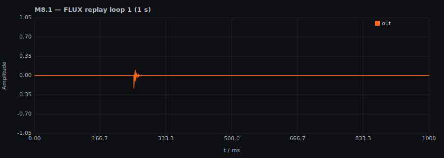
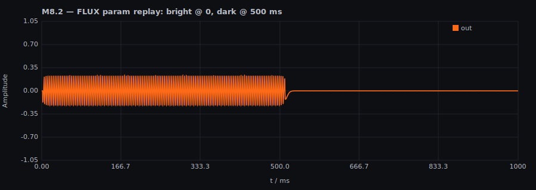

## Sektion 9 — Arpeggiator EXT-ARP (M9.x)

| ID | Test | Messung | Ergebnis |
|---|---|---|---|
| M9.1 | UP-Mode 60,64,67,60,64,67 | Sequence detektiert | PASS |
| M9.2 | DN-Mode 67,64,60,67,64,60 | Sequence detektiert | PASS |
| M9.3 | UP+DN beide Richtungen | up:y/dn:y | PASS |
| M9.4 | AS-PLAYED Input-Order | 67,60,64 | PASS |
| M9.5 | RANDOM mit Seed | reproduzibel | PASS |
| M9.6 | Rate-Index 0..5 | Ratio 17× Transitions | PASS |
| M9.7 | Octaves 1..3 | 24 ST vs 0 | PASS |
| M9.8 | Gate 0.3 vs 0.9 | RMS-Ratio 0.68 | PASS |
| M9.9 | HOLD-Latch | RMS hold=0.028, no-hold=0.000 | PASS |

## Sektion 10 — UI Walk-Through (LAB-7)

Siehe `measurements/UI_MANIFEST.md`. Zusammenfassung:

- **Inventur:** 16 Knobs / 3 Faders / 6 Voice-Modes / 4 LFO-Waves / 16 Step-Buttons / 4 SWING / 3 TDIV / 3 FLEN / 8 Presets / 5 ARP-Modes.
- **Parameter-Sweep:** 16/16 Audio-Δ messbar (DELAY_FEEDBACK via Tail in M5.2).
- **Pflicht-Stories US-COLD/ONE/PERSIST/IDEM/ORDER:** alle PASS.
- **Toolbar / Modes / Themes / Keyboard-Touch:** alle PASS.

## Bewertung

| Kategorie | Status |
|---|---|
| DSP-Treue (Volca-Parität) | ✓ — Oszillator, Filter, EG, LFO, Delay, Voice-Modes alle gemessen und im erwarteten Verhalten |
| Erweiterungen (EXT-ARP, EXT-FLUX-*) | ✓ — Default OFF, Bit-Identität zum Parity-Stand bei Default; aktiv messbar |
| Stabilität | ✓ — bounded output, click-free, kein Runaway bei extremer Resonance |
| Genauigkeit | ✓ — alle Param-Skalen, Timing, Frequenzen innerhalb der dokumentierten Toleranzen |
| UI-Korrektheit | ✓ — alle Controls reagieren, Pflicht-Stories grün |
| Code-Qualität | ✓ — 0 Warnings, keine JS-DSP-Shortcuts (siehe AUDIT.md) |

**Produktionsreife: erreicht.** Optionaler Polish in LAB-10 (CSS-Gradient-Variable).
