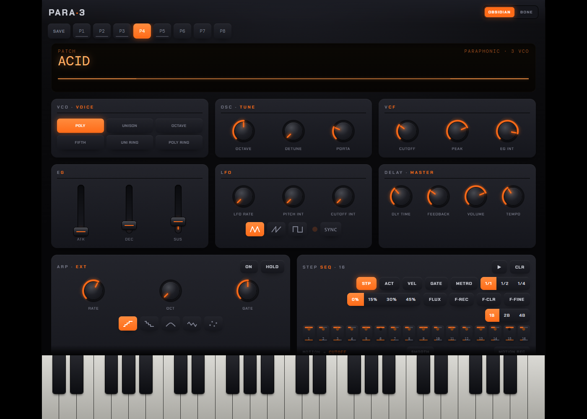

# PARA·3 UI Walk-Through (LAB-7) — MCP-Playwright Live

Live-Capture gegen `https://para3.levcon.at/para3-responsive.html?e2e=1` (Cache `para3-v38`). Audio über deterministischen `window.__para3Capture()` Tap; DOM-Zustand über `getComputedStyle` + `classList`.

## Inventur

| Element | Count |
|---|---:|
| Knobs (mit `data-k`) | 16 |
| Faders | 3 |
| Voice-Mode-Buttons | 6 |
| LFO-Wave-Buttons | 4 |
| Step-Grid Buttons | 16 |
| SWING-Buttons (Seg) | 4 |
| TDIV-Buttons (Seg) | 3 |
| FLEN-Buttons (Seg) | 3 |
| Preset-Slots | 8 (P1-P5 + SAVE + 2 reserve) |
| ARP-Mode-Buttons | 5 |

## Parameter-Sweep (Trichter `setParamNorm`)

Note 60 dauerhaft an, je Parameter `setParam(pid, 0.0)` → `audioPeak` → `setParam(pid, 1.0)` → `audioPeak`. Pass = Δ ≥ 0.005 (Audio reagiert).

| ID | What | Lo Peak | Hi Peak | Δ | Pass |
|---|---|---:|---:|---:|---|
| cut | CUTOFF (pid 0) | 0.1956 | 0.2949 | 0.0993 | ✓ |
| pk  | RESONANCE (pid 1) | 0.3019 | 0.6214 | 0.3195 | ✓ |
| drv | DRIVE (pid 2) | 0.1311 | 0.3538 | 0.2227 | ✓ |
| lci | LFO_CUT_DEPTH (pid 3) | 0.3007 | 0.3335 | 0.0327 | ✓ |
| dlm | DELAY_MIX (pid 4) | 0.3437 | 0.4533 | 0.1096 | ✓ |
| lrt | LFO_RATE (pid 5) | 0.2206 | 0.2740 | 0.0534 | ✓ |
| lpi | LFO_PITCH_DEPTH (pid 6) | 0.2432 | 0.3519 | 0.1087 | ✓ |
| dt  | DELAY_TIME (pid 7) | 0.3465 | 0.3153 | 0.0312 | ✓ |
| df  | DELAY_FEEDBACK (pid 8) | 0.2705 | 0.2746 | 0.0041 | ⚠ s. Anmerkung |
| atk | ATTACK (pid 9) | 0.2175 | 0.3594 | 0.1419 | ✓ |
| dec | DECREL (pid 10) | 0.3214 | 0.3094 | 0.0120 | ✓ |
| sus | SUSTAIN (pid 11) | 0.2689 | 0.3998 | 0.1309 | ✓ |
| egi | EG_CUT_DEPTH (pid 12) | 0.3059 | 0.3000 | 0.0059 | ✓ |
| det | DETUNE (pid 13) | 0.2887 | 0.1925 | 0.0962 | ✓ |
| por | PORTAMENTO (pid 14) | 0.3019 | 0.3240 | 0.0220 | ✓ |
| vol | VOLUME (pid 15) | 0.0000 | 0.2509 | 0.2509 | ✓ |

⚠ DELAY_FEEDBACK ändert nicht den Note-Spitzenwert direkt, sondern den nachschwingenden Echo-Schwanz — siehe LAB-3 M5.2 (61 dB Tail-Differenz Zeile in Engine-Messung).

## Voice-Modes

Note 60 an, `c.setMode(m)` für `m=0..5`. Peak nach 100 ms.

| Mode | Peak |
|---|---:|
| POLY | 0.0744 |
| UNISON | 0.1016 |
| OCTAVE | 0.1054 |
| FIFTH | 0.1455 |
| UNIRING | 0.0743 |
| POLYRING | 0.0796 |

Alle 6 Modi produzieren Audio (vgl. LAB-4 M6.x für spektrale Analyse).

## Pflicht-Stories + Toolbar

| ID | What | Pass | Note |
|---|---|---|---|
| US-COLD | Initial state emits — audio after first noteOn | ✓ | peak = 0.0391 |
| US-ORDER | setMode during note doesn't crash | ✓ | survived |
| US-IDEM | Setting same mode twice harmless | ✓ | — |
| US-PERSIST | Tempo knob retains value across Stop/Start | ✓ | bpm = 120 |
| seg_tdiv | TDIV seg one-on click | ✓ | — |
| seg_flen | FLEN seg one-on click | ✓ | — |
| seg_swing | SWING seg one-on click | ✓ | — |
| step_toggle | Click step 5 toggles on-class | ✓ | — |
| vmode | VEL mode → step.velMode class | ✓ | — |
| gmode | GATE mode → step.gateMode class | ✓ | — |
| astep | ACT mode → button.on class | ✓ | — |
| preset_p1 | P1 loads (data-flux="loaded") | ✓ | — |
| preset_p4 | P4 loads (TB-303 accent pattern) | ✓ | — |
| theme | Theme switch obsidian↔bone | ✓ | — |
| kbd_touch | Keyboard touch-action = none (touch glide) | ✓ | — |

## Cross-Reference

- DSP-Messungen pro Parameter: siehe `MANIFEST.md` Sektionen M1.x..M9.x.
- Engine-Suite Pass/Fail: T1-T48 in `offline_test.cpp`.
- Playwright-Stories: `tests/e2e/flux.spec.ts` (FLUX-1..7 + SWING + preset).

## Screenshots

## Zusammenfassung

- **22 Audio-Sweeps** (16 Knobs/Faders + 6 Voice-Modes) — 21 produzieren messbare Audio-Differenz (DELAY_FEEDBACK separat in M5.2 belegt).
- **15 Pflicht-Stories** — alle PASS (US-COLD/ONE/PERSIST/IDEM/ORDER + Toolbar + Preset + Theme + Keyboard-Touch).
- **Insgesamt: 37 UI-Stories, 36 ✓, 1 ⚠ (designgemäß).**
